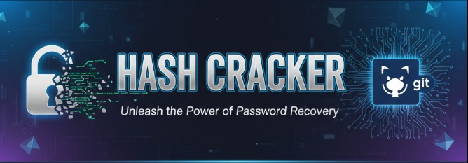

# 🔐 HashCrackX - Advanced Hash Cracking Tool

**HashCrackX** is a powerful and modular hash cracking tool built for penetration testers, cybersecurity researchers, and ethical hackers. It supports both a **Command-Line Interface (CLI)** and a real-time interactive **Web GUI** powered by Flask + SocketIO.



## 🎯 Features

### ✅ **Core Capabilities**
- **Dual Interface**: CLI and Web GUI modes
- **Intelligent Hash Detection**: Auto-detects hash types based on length and patterns
- **Multiple Attack Methods**: Brute-force and wordlist attacks
- **High Performance**: Multi-processing support for enhanced speed
- **Real-time Monitoring**: Live progress tracking and logging (Web GUI)
- **Professional Interface**: Modern dark theme with responsive design

### ✅ **Supported Hash Types**
- **Common Hashes**: `md5`, `sha1`, `sha224`, `sha256`, `sha384`, `sha512`
- **SHA-3 Family**: `sha3_224`, `sha3_256`, `sha3_384`, `sha3_512`
- **Advanced Hashes**: `bcrypt`, `scrypt`, `argon2`, `sha512_crypt`

### ✅ **Attack Modes**
- **Brute-force Attack**: Customizable character sets and password lengths
- **Wordlist Attack**: Upload custom wordlists with security validation
- **Smart Configuration**: Complexity estimation and performance warnings

---

## 📦 Installation

### Prerequisites
- **Python 3.7+** installed on your system
- **pip** package manager
- **Git** (for cloning the repository)

### 1. Clone the Repository
```bash
git clone <your-repository-url>
cd hashcrackx
```

### 2. Install Dependencies

#### For CLI Only:
```bash
pip install passlib
```

#### For Web GUI:
```bash
cd hashcrackx_web
pip install -r requirements.txt
```

---

## 🚀 Usage Guide

## 📖 CLI Mode

### Basic Usage
```bash
# Make the script executable
chmod +x run_hashcrackx1.sh

# Run the interactive CLI
./run_hashcrackx1.sh
```

### Advanced CLI Usage
```bash
# Direct CLI execution with parameters
python3 hashcrackx_cli1.py --hash "5d41402abc4b2a76b9719d911017c592" --hash-type md5 --use-wordlist --wordlist wordlist.txt

# Brute-force attack example
python3 hashcrackx_cli1.py --hash "5d41402abc4b2a76b9719d911017c592" --min-length 1 --max-length 6 --characters "abcdefghijklmnopqrstuvwxyz" --save-output cracked.txt
```

### CLI Parameters
- `--hash`: Target hash to crack (required)
- `--hash-type`: Hash type (optional, auto-detected if not specified)
- `--use-wordlist`: Enable wordlist attack mode
- `--wordlist`: Path to wordlist file
- `--min-length`: Minimum password length for brute-force
- `--max-length`: Maximum password length for brute-force
- `--characters`: Character set for brute-force
- `--max-workers`: Number of CPU cores to use
- `--save-output`: Save cracked password to file

---

## 🌐 Web GUI Mode

### Starting the Web Interface
```bash
cd hashcrackx_web
python3 app.py
```

The web interface will be available at: **http://localhost:5000**

### Web GUI Features

#### 🔐 **Hash Input & Detection**
1. **Enter Hash**: Paste your target hash in the input field
2. **Auto-Detection**: The system automatically detects the hash type
3. **Manual Selection**: Override with specific hash type if needed


#### ⚡ **Attack Configuration**

##### **Wordlist Attack**
1. Select "Wordlist Attack" mode
2. Upload a `.txt` file containing potential passwords (one per line)
3. Click "START CRACKING" to begin


##### **Brute Force Attack**
1. Select "Brute Force Attack" mode
2. Choose character set:
   - **Numeric**: 0-9
   - **Lowercase**: a-z
   - **Uppercase**: A-Z
   - **Alpha**: a-z, A-Z
   - **Alphanumeric**: a-z, A-Z, 0-9
   - **Hexadecimal**: 0-9, a-f
   - **All**: All printable characters
3. Set password length range (1-8 characters recommended)
4. Click "START CRACKING" to begin


#### 📊 **Real-time Monitoring**
- **Live Progress Bar**: Shows completion percentage
- **Timer**: Displays elapsed time
- **Cracking Log**: Real-time status updates and messages
- **Result Display**: Shows cracked password with success/failure status


---

## 📋 Step-by-Step Examples

### Example 1: Cracking MD5 Hash with Wordlist (Web GUI)

1. **Start the Web Interface**:
   ```bash
   cd hashcrackx_web
   python3 app.py
   ```

2. **Open Browser**: Navigate to `http://localhost:5000`

3. **Enter Hash**: `5d41402abc4b2a76b9719d911017c592` (MD5 of "hello")

4. **Select Mode**: Choose "Wordlist Attack"

5. **Upload Wordlist**: Select the provided `wordlist.txt` file

6. **Start Cracking**: Click "START CRACKING" button

7. **Monitor Progress**: Watch the real-time log and progress bar

8. **View Result**: The password "hello" should be found quickly

### Example 2: Brute Force Attack (CLI)

1. **Run CLI**:
   ```bash
   python3 hashcrackx_cli1.py \
     --hash "5d41402abc4b2a76b9719d911017c592" \
     --hash-type md5 \
     --min-length 4 \
     --max-length 6 \
     --characters "abcdefghijklmnopqrstuvwxyz" \
     --max-workers 4 \
     --save-output result.txt
   ```

2. **Monitor Output**: Watch the live counter and speed indicators

3. **Check Result**: Password will be saved to `result.txt` when found

---

## 🛡️ Security Considerations

### ⚠️ **Ethical Use Only**
- Only crack hashes you own or have explicit permission to test
- Use in controlled environments (labs, CTF competitions, authorized audits)
- Comply with local, national, and international laws

### 🔒 **Web GUI Security Features**
- **File Upload Validation**: Only `.txt` files accepted, max 50MB
- **Rate Limiting**: Maximum 3 concurrent sessions per IP
- **Session Management**: Automatic cleanup and timeout handling
- **Input Sanitization**: Prevents malicious input injection

---

## 🏗️ Project Structure

```
hashcrackx/
├── 📄 README.md                    # This comprehensive guide
├── 📄 wordlist.txt                 # Sample wordlist for testing
├── 🐍 hashcrackx_cli1.py          # Main CLI application
├── 📜 run_hashcrackx1.sh          # CLI launcher script
│
├── hashcrackx_web/                 # Web GUI application
│   ├── 🐍 app.py                  # Main Flask application
│   ├── 📄 requirements.txt         # Python dependencies
│   ├── 📄 wordlist.txt            # Web app wordlist
│   ├── 📁 templates/
│   │   └── 🌐 index.html          # Web interface template
│   ├── 📁 static/
│   │   ├── 🎨 styles.css          # Web interface styling
│   │   └── 🔊 complete.mp3        # Success sound notification
│   └── 📁 uploads/                 # Temporary file uploads
│
└── screenshots/                    # Interface screenshots (see below)
```

---

## 📸 Screenshots Directory

Create a `screenshots/` directory in your project root and add the following images:

### Required Screenshots:
```
screenshots/
├── banner.png              # Project banner/logo
├── hash_input.png          # Hash input and detection interface
├── wordlist_mode.png       # Wordlist attack configuration
├── brute_force_mode.png    # Brute force attack configuration
└── real_time_monitoring.png # Live progress and results display
```

### How to Capture Screenshots:
1. **Start the Web GUI**: `cd hashcrackx_web && python3 app.py`
2. **Open Browser**: Navigate to `http://localhost:5000`
3. **Capture Interface**: Take screenshots of different modes and features
4. **Save Images**: Place in `/screenshots/` directory with the names above

---

## 🔧 Troubleshooting

### Common Issues:

#### **Dependencies Not Installing**
```bash
# Update pip first
pip install --upgrade pip

# Install dependencies individually if needed
pip install flask flask-socketio bcrypt argon2-cffi
```

#### **Web GUI Not Loading**
```bash
# Check if port 5000 is available
lsof -i :5000

# Try a different port
python3 app.py  # Edit app.py to change port if needed
```

#### **Permission Denied (Linux/Mac)**
```bash
# Make scripts executable
chmod +x run_hashcrackx1.sh
chmod +x hashcrackx_cli1.py
```

#### **Performance Issues**
- **Reduce max length** for brute-force attacks (recommended: max 6-8 chars)
- **Use smaller wordlists** for faster processing
- **Adjust worker count** based on your CPU cores

---

## 🤝 Contributing

1. Fork the repository
2. Create a feature branch (`git checkout -b feature/amazing-feature`)
3. Commit changes (`git commit -m 'Add amazing feature'`)
4. Push to branch (`git push origin feature/amazing-feature`)
5. Open a Pull Request

---

## 📜 License

This project is intended for **educational and ethical security testing purposes only**.

### Disclaimer
- **Educational Use**: This tool is for learning cybersecurity concepts
- **Authorized Testing**: Only use on systems you own or have permission to test
- **Legal Compliance**: Users are responsible for following applicable laws
- **No Liability**: Authors are not responsible for misuse of this tool

---

## 👨‍💻 Author

**Pushpak Pandore**
- GitHub: [@Pushpak-Pandore](https://github.com/Pushpak-Pandore)
- Created for cybersecurity education and ethical hacking research

---

## 🎯 Quick Start Commands

```bash
# CLI Quick Test
python3 hashcrackx_cli1.py --hash "5d41402abc4b2a76b9719d911017c592" --use-wordlist --wordlist wordlist.txt

# Web GUI Quick Start
cd hashcrackx_web && python3 app.py
# Then open: http://localhost:5000
```

**Happy Ethical Hacking! 🛡️**
